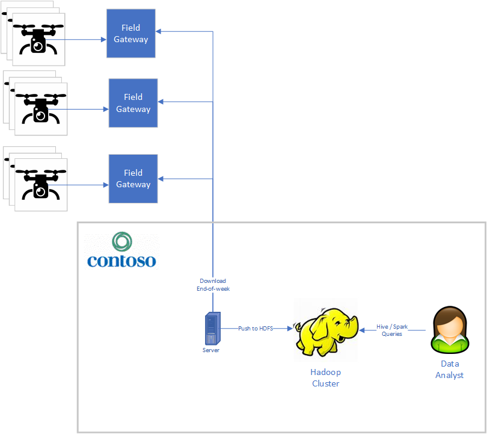

# Business Context

Contonso Corporation operates a fleet of agricultural drones used for surveilling crops and monitor the environment.

They recently scaled up the size of the fleet and have had operational challenges since.  For instance, they lose drones in the fields while some are malfunctioning.  In general, they have a hard time analysing the telemetry they are capturing using their current Hadoop-based stack.  The data is piling up and they can't get value out of the data in a timely fashion.  Their Data Science unit have developped some models but they can't use them in real time.

They want to explore new ways of analysing data and see what benefit those could bring.  They want to reuse their IoT solution based on Azure IoT Hub but change the data analysis stack to a Azure-based solution.  They have the following requirements:

1.   Focus on the non-video device telemetry (e.g. temperature, pressure, GPS position, etc.)
1.   Managed solution:  they do not want to manage VMs
1.   Security:  part of their data is sensitive and so we need to control access and avoid data-exfiltration
1.   Monitoring:  they need to monitor the platform (e.g. CPU usage)
1.   Real Time:  they want the data to be available for analysis in less than one minute latency
1.   Ad Hoc queries:  they want the platform to be able to perform exploratory query without shaping the data (e.g. designing indexes) in a special way for the queries
1.   Visualization:  they do not want the platform to only deal with data to be visualized with other tools ; they would like for the platform to allow visualization as close to the querying tool as possible
1.   Ability to deal with duplicates, late duplicates and late arrival data:  the communication between the drones and the field gateway and the field gateway and the IoT Hub isn't always possible and the platform must be able to deal with those elements
1.   Time series:  a lot of analysis they want to perform is based on time series of different measurements ; the platform must be able to do those as natively as possible
1.   Export to data lake:  their data science will still need the data for long-term analysis in the data lake (Azure Data Lake Storage gen 2)
1.   Reporting:  different stakeholders in the company must be able to look at dashboards for a summary look at the fleet
1.   Democratization of data analysis:  Contoso is positioning themselves more and more as a *Data Enterprise* ; they want more and more of their employee to be able to look and explore operational data
